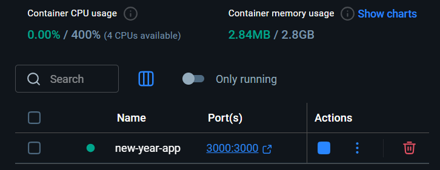
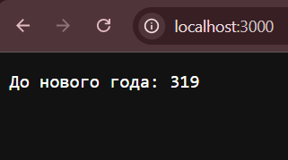

<h1> Web programming and mobile applications</h1>

<h2>Lab 🎄 - new-year-counter</h2>

Использовали:

<ul>
  <li>Go</li>
  <li>Docker</li>
</ul>

Инструкция

<ul>
  <li>Скачать</li>
  <li>Собрать проект командой - <b>docker build -t new-year-counter .</b></li>
  <li>Запустить проект - <b>docker run -d -p 3000:3000 --name new-year-app new-year-counter<b></li>
  <li>Запрос на получение результата - <b>curl http://localhost:3000</b></li>
</ul>

Быстрый обзор результата

<h3>Что отображается в docker</h3>

 
<h3>Что отображается в браузере (если всё хорошо)</h3>

<i>Приносим изменения за отсуцтвие коментариев в коде</i>
