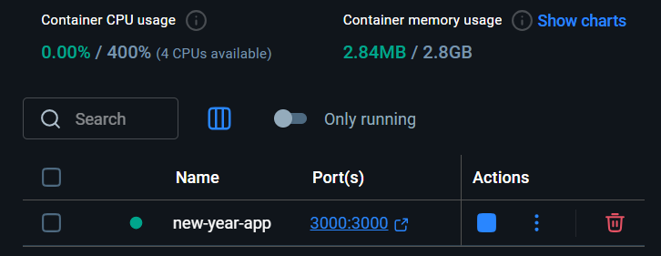
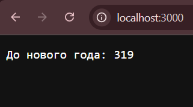
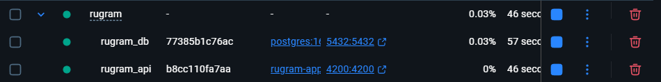
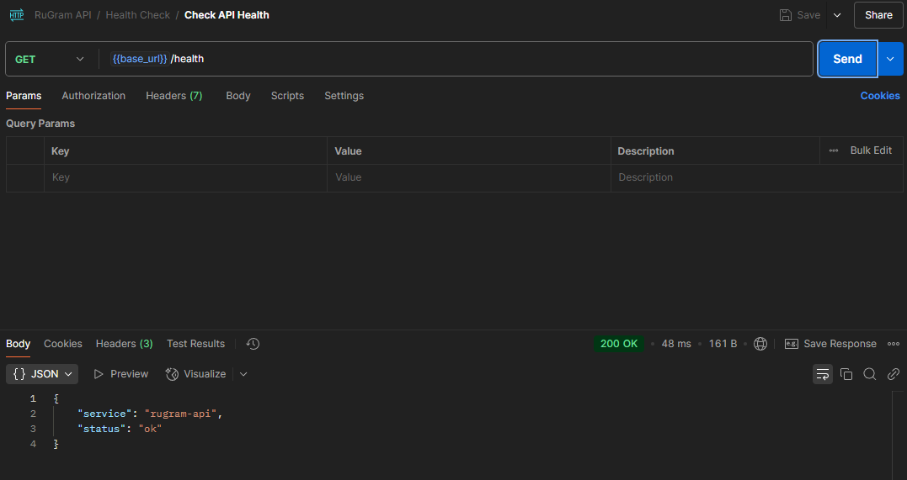

<h1> Web programming and mobile applications</h1>

  
<h2>🎄 Lab 1 - new-year-counter</h2>

  
  
Использовали:

  <ul>
    <li>Go</li>
    <li>Docker</li>
  </ul>
  
  
Инструкция

  <ul>
    <li>Скачать</li>
    <li>Собрать проект командой - <b>docker build -t new-year-counter .</b></li>
    <li>Запустить проект - <b>docker run -d -p 3000:3000 --name new-year-app new-year-counter<b></li>
    <li>Запрос на получение результата - <b>curl http://localhost:3000</b></li>
  </ul>
  
  
Быстрый обзор результата

  <h3>Что отображается в docker</h3>
  
   
  <h3>Что отображается в браузере (если всё хорошо)</h3>
  
  
  <i>Приносим изменения за отсуцтвие коментариев в коде</i>

<h1>Rugram API - Social Media Backend Service</h1>

  
<h2>📱 Lab 2 - rugram-api</h2>

  
  <h3>Используемые технологии:</h3>
  <ul>
    <li><b>Go 1.21+</b> - основной язык разработки</li>
    <li><b>Gin Framework</b> - HTTP веб-фреймворк</li>
    <li><b>PostgreSQL 16</b> - реляционная база данных</li>
    <li><b>Docker & Docker Compose</b> - контейнеризация и оркестрация</li>
    <li><b>lib/pq</b> - драйвер PostgreSQL для Go</li>
    <li><b>godotenv</b> - управление переменными окружения</li>
    <li><b>google/uuid</b> - генерация уникальных идентификаторов</li>
  </ul>
  
  <h3>Архитектура проекта</h3>
  <ul>
    <li><b>Models</b> - слой данных (структуры БД)</li>
    <li><b>Repository</b> - слой доступа к данным (SQL запросы)</li>
    <li><b>Service</b> - слой бизнес-логики</li>
    <li><b>Handlers</b> - HTTP обработчики (контроллеры)</li>
    <li><b>DTO</b> - объекты передачи данных (запросы/ответы API)</li>
    <li><b>Config</b> - управление конфигурацией через .env</li>
  </ul>
  
  <h3>REST API Endpoints</h3>
  <table>
    <tr>
      <th>Method</th>
      <th>Endpoint</th>
      <th>Description</th>
    </tr>
    <tr>
      <td>GET</td>
      <td>/api/v1/posts</td>
      <td>Получить все посты (с пагинацией)</td>
    </tr>
    <tr>
      <td>GET</td>
      <td>/api/v1/posts/:id</td>
      <td>Получить пост по ID</td>
    </tr>
    <tr>
      <td>POST</td>
      <td>/api/v1/posts</td>
      <td>Создать новый пост</td>
    </tr>
    <tr>
      <td>PUT</td>
      <td>/api/v1/posts/:id</td>
      <td>Полностью обновить пост</td>
    </tr>
    <tr>
      <td>PATCH</td>
      <td>/api/v1/posts/:id</td>
      <td>Частично обновить пост</td>
    </tr>
    <tr>
      <td>DELETE</td>
      <td>/api/v1/posts/:id</td>
      <td>Мягкое удаление поста</td>
    </tr>
    <tr>
      <td>GET</td>
      <td>/api/v1/posts/user/:userId</td>
      <td>Получить посты пользователя</td>
    </tr>
    <tr>
      <td>GET</td>
      <td>/health</td>
      <td>Health check сервиса</td>
    </tr>
  </table>
  
  <h3>Модель данных (Post)</h3>
  <ul>
    <li><b>ID</b> - UUID (уникальный идентификатор)</li>
    <li><b>UserID</b> - идентификатор автора (string)</li>
    <li><b>Title</b> - заголовок (max 200 символов)</li>
    <li><b>Description</b> - описание (max 1000 символов)</li>
    <li><b>ImageURL</b> - ссылка на изображение</li>
    <li><b>Status</b> - статус (active/draft/archived)</li>
    <li><b>LikesCount</b> - количество лайков</li>
    <li><b>CreatedAt/UpdatedAt</b> - временные метки</li>
    <li><b>DeletedAt</b> - мягкое удаление (soft delete)</li>
  </ul>
  
  <h3>Инструкция по запуску с Docker</h3>
  
  
<b>1. Клонировать репозиторий</b>

  <pre><code>git clone https://github.com/yourusername/rugram-api.git
cd rugram-api</code></pre>
  
  
<b>2. Создать файл .env с переменными окружения</b>

  <pre><code>DB_HOST=postgres
DB_PORT=5432
DB_USER=rugram_user
DB_PASSWORD=rugram_password
DB_NAME=rugram_db
APP_PORT=4200
APP_ENV=development
DEFAULT_PAGE=1
DEFAULT_LIMIT=10
MAX_LIMIT=100</code></pre>
  
  
<b>3. Собрать и запустить проект через Docker Compose</b>

  <pre><code># Собрать образы и запустить контейнеры
docker-compose up -d --build

# Просмотреть логи
docker-compose logs -f

# Остановить контейнеры
docker-compose down

# Полностью очистить (с удалением данных БД)
docker-compose down -v</code></pre>
  
  
<b>4. Альтернативный запуск без Docker</b>

  <pre><code># Установить зависимости
go mod download

# Запустить PostgreSQL вручную и изменить DB_HOST=localhost в .env
go run main.go</code></pre>
  
  <h3>🔧 Тестирование API запросов</h3>
  
  
<b>Health check</b>

  <pre><code>curl http://localhost:4200/health</code></pre>
  
  
<b>Создать пост</b>

  <pre><code>curl -X POST http://localhost:4200/api/v1/posts \
  -H "Content-Type: application/json" \
  -d '{
    "user_id": "user123",
    "title": "Мой первый пост",
    "description": "Это тестовый пост",
    "status": "active"
  }'</code></pre>
  
  
<b>Получить все посты (с пагинацией)</b>

  <pre><code>curl "http://localhost:4200/api/v1/posts?page=1&limit=10"</code></pre>
  
  
<b>Получить пост по ID</b>

  <pre><code>curl http://localhost:4200/api/v1/posts/{post_id}</code></pre>
  
  
<b>Обновить пост</b>

  <pre><code>curl -X PUT http://localhost:4200/api/v1/posts/{post_id} \
  -H "Content-Type: application/json" \
  -d '{
    "title": "Обновленный заголовок",
    "status": "archived"
  }'</code></pre>
  
  
<b>Удалить пост (мягкое удаление)</b>

  <pre><code>curl -X DELETE http://localhost:4200/api/v1/posts/{post_id}</code></pre>
  
  <h3>Пример ответа API</h3>
  
  
<b>Успешный ответ (200 OK)</b>

  <pre><code>{
  "success": true,
  "data": {
    "id": "123e4567-e89b-12d3-a456-426614174000",
    "user_id": "user123",
    "title": "Мой первый пост",
    "description": "Это тестовый пост",
    "image_url": "",
    "status": "active",
    "likes_count": 0,
    "created_at": "2026-04-03T18:00:00Z",
    "updated_at": "2026-04-03T18:00:00Z"
  }
}</code></pre>
  
  
<b>Пагинированный ответ</b>

  <pre><code>{
  "success": true,
  "data": {
    "data": [...],
    "meta": {
      "total": 25,
      "page": 1,
      "limit": 10,
      "total_pages": 3
    }
  }
}</code></pre>
  
  <h3>Решение типичных проблем</h3>
  
  
<b>Ошибка: "database 'rugram_user' does not exist"</b>

  <ul>
    <li>Проверьте .env файл: DB_NAME=rugram_db (не DB_USER)</li>
    <li>Очистите тома Docker: <code>docker-compose down -v</code></li>
    <li>Пересоберите проект: <code>docker-compose up -d --build</code></li>
  </ul>
  
  
<b>Порт уже занят</b>

  <ul>
    <li>Смените порт в .env: <code>APP_PORT=4201</code></li>
    <li>Или остановите процесс: <code>lsof -i :4200 && kill PID</code></li>
  </ul>
  
  <h3>Скриншоты работы</h3>
  
  <h4>Docker контейнеры в работе</h4>
  
  
  <h4>Health check эндпоинт</h4>
  
  
  <h4>Создание поста через curl</h4>
  
  
  <h4>Получение списка постов</h4>
  
  
  <h4>Логи приложения</h4>
  
  
  <h4>PostgreSQL база данных</h4>
  
  
  <h3>Структура проекта</h3>
  <pre><code>rugram-api/
├── cmd/
│   └── main.go                 # Точка входа
├── internal/
│   ├── config/
│   │   └── config.go          # Конфигурация (.env)
│   ├── database/
│   │   ├── db.go              # Подключение к БД
│   │   └── migrations/        
│   │       └── 001_create_posts_table.sql
│   ├── models/
│   │   └── post.go            # Модель данных
│   ├── repository/
│   │   └── post_repository.go # Слой доступа к данным
│   ├── service/
│   │   └── post_service.go    # Бизнес-логика
│   ├── handlers/
│   │   └── post_handler.go    # HTTP обработчики
│   └── dto/
│       └── post.go            # DTO для API
├── pkg/
│   └── utils/
│       └── response.go        # Утилиты ответов
├── .env                        # Переменные окружения
├── docker-compose.yml          # Docker Compose конфиг
├── Dockerfile                  # Docker образ
└── go.mod                      # Go зависимости</code></pre>

